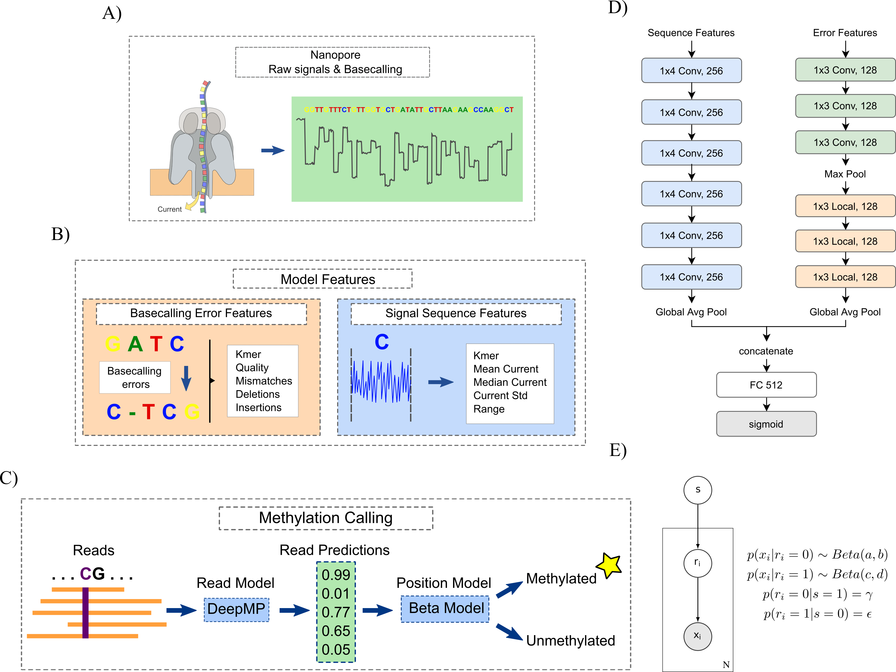

# DeepMP
DeepMP is a convolutional neural network (CNN)-based model that takes information from Nanopore signals and basecalling errors to detect whether a read is methylated or not.  DeepMP's architecture consists of two different modules. First, the sequence module involves 6 1D convolutional layers with 256 1x4 filters. On the other hand, the error module comprises 3 1D convolutional layers and 3 locally connected layers both with 128 1x3 filters. Outputs are finally concatenated and inputted into a fully connected layer with 512 units.
Furthermore, DeepMP introduces a threshold-free position modification calling model sensitive to sites methylated at low frequency across cells. These novelties allow DeepMP to accurately detect methylated sites at read and position levels. 




# Contents
- [Installation](#Installation)
- [Usage](#Usage)
- [Example data](#Example-data)         

# Installation
## Clone repository
First download DeepMP from the github repository:

        git clone https://github.com/pepebonet/DeepMP.git

## Install dependencies
We highly recommend to use a virtual environment for the installation and employment of DeepMP:

`Create environment and install DeepMP:`

        conda create --name deepmp_2021 python=3.8
        conda activate deepmp_2021
        pip install -e .

`Install additional dependencies:`

        pip install ont-tombo
        pip install biopython
        conda install -c bioconda samtools
        conda install -c bioconda minimap2
        conda install -c anaconda openjdk
        conda install -c anaconda bottleneck
        
# Usage

This section highlights the main functionalities of DeepMP and the commands to run them. For a detailed insight into the whole process of predicting modifications go to the [Example data](#Example-data) section. 

### Feature extraction:
Features for the model need to be extracted. We present 3 different options: 

`Option 1:` Extract combined features
```
    DeepMP combined-extraction -fr path/to/fast5/files/ -re path/to/error/folder/ -rp path/to/reference/file/ -dn path/to/dict_read_names -m CG -o CpG_methylated_combined.tsv -ml 1 -cpu 56
```

`Option 2:` Extract sequence features
```
    DeepMP sequence-feature-extraction path/to/fast5/files/ -rp path/to/reference/file/ -m CG -o CpG_methylated.tsv -ml 1 -cpu 56
```

`Option 3:` Extract error features
```
    DeepMP single-read-error-extraction -ef path/to/error/folder/ -m CG -o output/error_features/ -l 1 -cpu 56
```

### Preprocess:
Extracted features are processed to get the information into h5 format which is the desired input for training, validation and testing. 

        DeepMP preprocess -f path/to/features.tsv  -ft combined -o output/folder/ -cpu 56


### Train models
Preprocessing is needed before training. Use `--model_type` flag to specify model for data preparation, choose between `seq` and `err`.
```
    DeepMP preprocess path/to/csv_file --model_type seq
```
Train sequence model from binary files.
```
    DeepMP train-nns -m seq -tf path/to/train/data -vf path/to/validation/data -md save/model/to/directory -ld save/log/to/directory
```
Train errors model from binary files.
```
    DeepMP train-nns -m err -tf path/to/train/data -vf path/to/validation/data -md save/model/to/directory -ld save/log/to/directory
```
Train joint model from binary files.
```
    DeepMP train-nns -m joint -tf path/to/train/data -vf path/to/validation/data -md save/model/to/directory -ld save/log/to/directory
```
- Use `-cp` to specify the checkpoint file while training model from checkpoints.


### Call modifications

Finally modifications for a given test set are obtained: 

```
    DeepMP call-modifications -m joint -tf path/to/test/data -md model/directory -o output/ -pos
```

- Specify model type with flag `-m`, choose from `seq, err, joint`(required).
- Add `-ef` for sequence model with both seq and error features.
- Add  `-pos` for test on positions.

#### Fast call modifications from fast5 files (under test)

DeepMP can call modifications from re-squiggled fast5 files in one step:

```
    DeepMP fast-call-joint -f path/to/fast5s/ -ref path/to/reference/genome -md path/to/trained_model -j path/to/sam2tsv.jar
```

Note that this function is currently under test, stepwise process is recommanded. Please see the following example for details.

# Example data
Step by step process to detect modifications employing DeepMP on a sample (20 reads) of the E. coli dataset. Data is located in: 

```
    docs/reads/
```

First, extract the fastqs from the reads (output paths need to be generated and updated for the following commands): 

```
python deepmp/miscellaneous/parse_fast5.py docs/reads/treated/ -ff5 True -o output/path/treated/ -cpu 56

python deepmp/miscellaneous/parse_fast5.py docs/reads/untreated/ -ff5 True -o output/path/untreated/ -cpu 56
```

Next, for both fastqs extracted, the reads are mapped to the reference genome. For that to be done, first load the following packages in your environment if you do not have them already. 

```
conda install -c bioconda samtools
conda install -c bioconda minimap2
conda install -c anaconda openjdk
```

Then, map reads to the genome with the reference genome available in /docs/ref/ : 
```
cd output/path/treated/ or output/path/untreated/

minimap2 -ax map-ont ~/DeepMP/docs/ref/Escherichia_coli_str_k_12_substr_mg1655.ASM584v2.dna.toplevel.fa Basecall_1D_000_BaseCalled_template.fastq | samtools view -hSb | samtools sort -@ 56 -o sample.bam 

samtools index sample.bam
```

The following step is to call the variants: 

```
samtools view -h -F 3844 sample.bam |  java -jar ~/DeepMP/docs/jvarkit/sam2tsv.jar -r ~/DeepMP/docs/ref/Escherichia_coli_str_k_12_substr_mg1655.ASM584v2.dna.toplevel.fa > sample.tsv
```

To allow downstream parallelisation of the feature extraction and further steps, the generated sample.tsv is split into the different reads in a tmp folder. 

```
mkdir tmp
awk 'NR==1{ h=$0 }NR>1{ print (!a[$2]++? h ORS $0 : $0) > "tmp/"$1".txt" }' sample.tsv
```

As in  some scenarios the readnames of the fastqs do not match the fast5 readnames, a dictionary to parse each read pair needs to be generated: 

```
pip install biopython

python ~/DeepMP/deepmp/miscellaneous/fix_read_names.py -dt Ecoli -f Basecall_1D_000_BaseCalled_template.fastq -o dict_reads.pkl
```

With all these steps done, we can now extract the combined features from the reads (paths should point to the right directories): 

```
DeepMP combine-extraction -fr ~/DeepMP/docs/reads/treated/ -re output/path/treated/tmp/ -rp  ~/DeepMP/docs/ref/Escherichia_coli_str_k_12_substr_mg1655.ASM584v2.dna.toplevel.fa -ml 1 -cpu 56 -m CG -dn output/path/treated/dict_reads.pkl -o treated_features.tsv

DeepMP combine-extraction -fr ~/DeepMP/docs/reads/untreated/ -re output/path/untreated/tmp/ -rp  ~/DeepMP/docs/ref/Escherichia_coli_str_k_12_substr_mg1655.ASM584v2.dna.toplevel.fa -ml 0 -cpu 56 -m CG -dn output/path/untreated/dict_reads.pkl -o treated_features.tsv
```

Once the features are extracted one can concat the resulting features of the treated and untreated samples into a single file to then perform the preprocess step: 

```
cat untreated_features.tsv treated_features.tsv > features.tsv

DeepMP preprocess -f features.tsv -ft combined -o . -cpu 4
```

With the test_file.h5 available we can now use one of the trained models to get the predictions from the model at read and position level: 

```
DeepMP call-modifications -m joint -md ~/DeepMP/trained_models/K12ER2925_joint_202101/ -tf test_file.h5 -pos
```

The resulting files of the analysis should be the read and position calling predictions from DeepMP: 

```
read_predictions_joint_DeepMP.tsv
position_calling_joint_DeepMP.tsv
```
